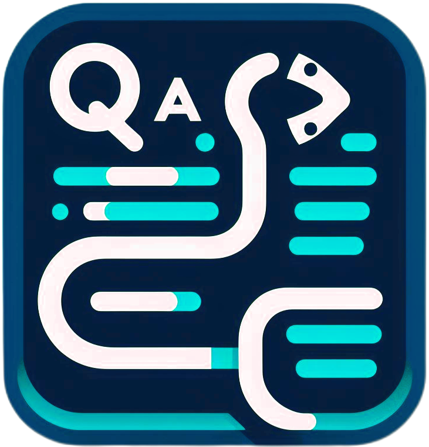

[](https://github.com/Daxexs)[](https://pypi.org/project/qa)

[](https://pepy.tech/project/qa) [](https://pypi.python.org/pypi/qa) [](https://pypi.python.org/pypi/qa) [](https://pypi.python.org/pypi/qa)

<div align="center">
    
</div>


# 🔥qa
`qa` is a client that takes care of creating the structure of a python project, it also supports packaging for pypi.org.

## 💻Installation:

```bash
  pip install qa
```

## 💻Update:
```bash
  pip install qa --upgrade
```

## 🔎 init:
> **To initialize the creation of a project structure.**
```bash
  qa init
```
## 🔎 version:
> **To know the version.**
```bash
  qa version
```